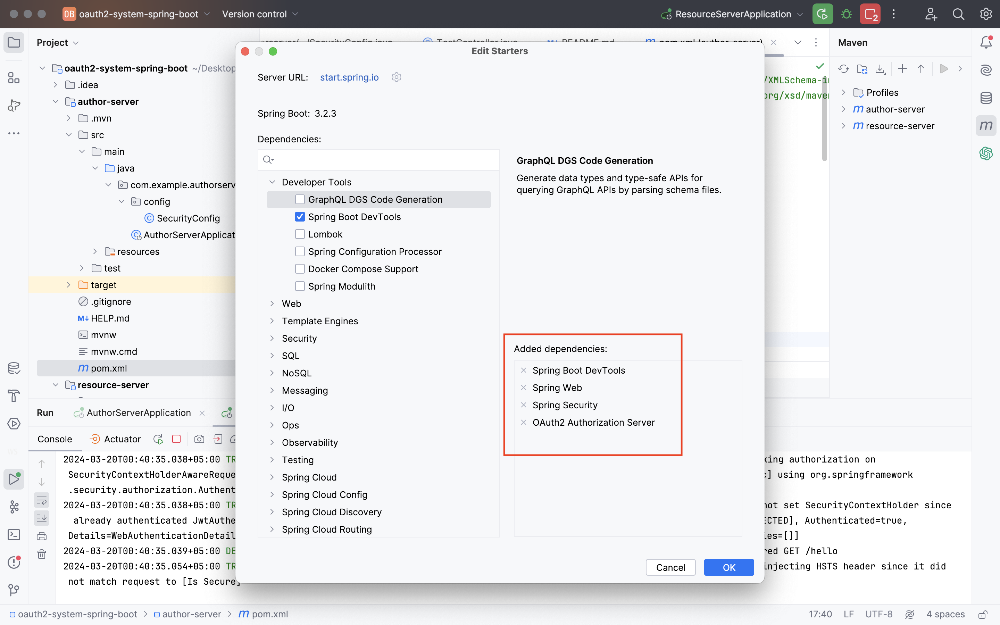
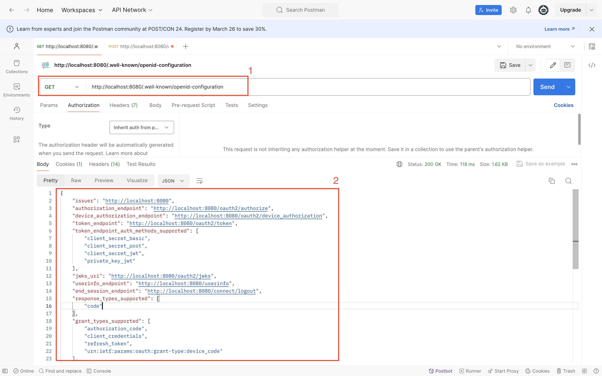
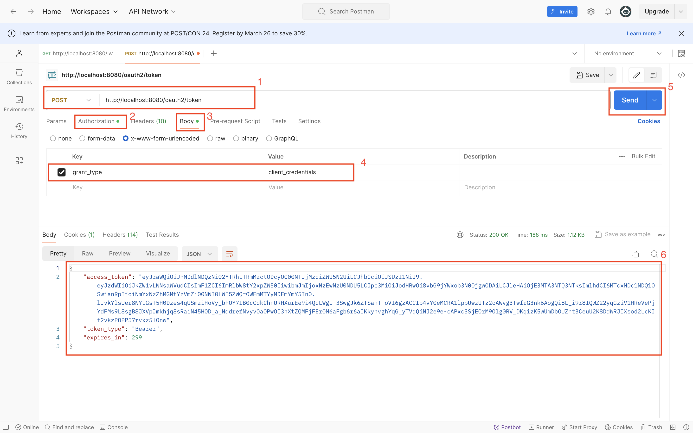
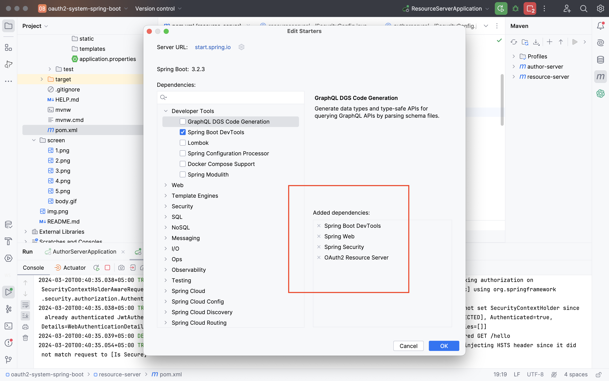
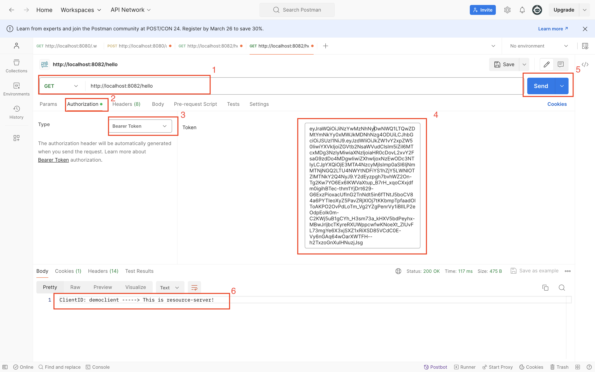

# Oauth2 system in Spring Boot (simple example)

### General structure of a simple system

### 1) Authorization Server (author-server)
#### a) Technologies of Authorization-server

#### b) All urls of author-server with OpenID (The port of the author server is 8080)

#### c) Getting an access token on the author-server

### 2) Resource-server (resource-server)
#### a) Technologies of Resource-server

#### b) Enter to resource-server with access-token

